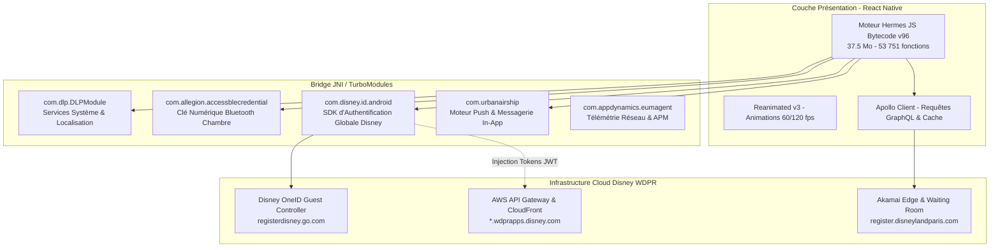

# 🏰 Disneyland Paris - Spécification Complète de l'Application & Guide des APIs Officielles

> **Version de l'application analysée** : `7.16.0` (Build `7507`, Build Label `KINNEY`, App ID `fr.disneylandparis.android`)  
> **Type d'architecture** : React Native (Hermes Bytecode v96) + SDKs Natifs Android (Kotlin / Java)  
> **Cible de ce document** : Développeurs & Agents IA souhaitant comprendre l'architecture interne complète de l'application Disneyland Paris et intégrer directement ses API officielles (WaitTimes, Schedules, GraphQL, OneID) de manière robuste.

---

## Table des Matières
1. [Architecture Interne de l'Application Mobile](#1-architecture-interne-de-lapplication-mobile)
2. [Cartographie Complète des APIs & Endpoints Officiels](#2-cartographie-complète-des-apis--endpoints-officiels)
   - [2.1 API WaitTimes : Temps d'Attente Temps Réel](#21-api-waittimes--temps-dattente-temps-réel)
   - [2.2 API Schedules & Entités : Requêtes GraphQL Officielles](#22-api-schedules--entités--requêtes-graphql-officielles)
   - [2.3 API Disney OneID : Authentification & Guest Controller](#23-api-disney-oneid--authentification--guest-controller)
   - [2.4 Services Billetterie, MagicMobile & Premier Access](#24-services-billetterie-magicmobile--premier-access)
   - [2.5 Services Hôteliers & Clé de Chambre Bluetooth (Allegion BLE)](#25-services-hôteliers--clé-de-chambre-bluetooth-allegion-ble)
3. [Analyse de Sécurité : Passerelle AWS, Akamai & Diagnostic du 403](#3-analyse-de-sécurité--passerelle-aws-akamai--diagnostic-du-403)
4. [Méthodologie d'Accès Direct Officiel (Interception & Rejeu)](#4-méthodologie-daccès-direct-officiel-interception--rejeu)
5. [Contrats de Données & Modèles de Types (TypeScript & Pydantic)](#5-contrats-de-données--modèles-de-types-typescript--pydantic)
6. [Règles d'Ingénierie pour Agents Autonomes ("Ne Rien Casser")](#6-règles-dingénierie-pour-agents-autonomes-ne-rien-casser)
7. [Client de Référence Python Asynchrone](#7-client-de-référence-python-asynchrone)
8. [Cas d'Usage Avancés & Idées de Projets](#8-cas-dusage-avancés--idées-de-projets)

---

## 1. Architecture Interne de l'Application Mobile

L'application officielle Disneyland Paris v7.16 est une application hybride de haute technicité, combinant une interface réactive multiplateforme et une couche de microservices natifs en Java/Kotlin :



### Principaux Composants Natifs Découverts dans le Code (`app/`) :
1. **`com.disney.id.android (OneID SDK)`** :
   - Le système d'authentification centralisé de The Walt Disney Company.
   - Gère le cycle de vie des sessions visiteurs (`GuestHandler`, `Token`, `Session`).
   - Implémente `AuthorizationInterceptor` qui injecte dynamiquement les jetons Bearer (`Authorization: BEARER <token>`) ou clés API (`Authorization: APIKEY <key>`).
2. **`com.allegion.accessblecredential`** :
   - Module matériel Bluetooth Low Energy (BLE).
   - Permet de transformer le smartphone en clé dématérialisée pour déverrouiller la porte des chambres des hôtels Disney (*Disneyland Hotel*, *Disney Hotel New York - The Art of Marvel*, *Newport Bay Club*, etc.).
3. **`com.urbanairship` (Airship SDK)** :
   - Moteur d'engagement temps réel gérant les notifications push géolocalisées, le déclenchement d'alertes lors de l'arrivée dans le parc et les notifications de rappel pour les files d'attente virtuelles.
4. **`com.appdynamics.eumagent.runtime`** :
   - Outil de métrique et de surveillance réseau (End User Monitoring) interceptant toutes les requêtes OkHttp pour auditer les temps de réponse et détecter les anomalies réseau.

---

## 2. Cartographie Complète des APIs & Endpoints Officiels

Toutes les données officielles proviennent de deux infrastructures distinctes : le cluster **WDPRApps** (sur AWS) et l'infrastructure **GraphQL / Web** (sur Akamai).

---

### 2.1 API WaitTimes : Temps d'Attente Temps Réel (Confirmé en Direct)

* **URL Principale (Live Production)** : `https://dlp-wt.wdprapps.disney.com/prod/v1/waitTimes`
* **Méthode** : `GET`
* **Protocole** : HTTPS / REST JSON (HTTP/2)
* **Authentification** : Clé API fixe (aucun compte utilisateur ni jeton Bearer requis pour le direct)

#### Headers Requis (Capturés & Validés)
```http
GET /prod/v1/waitTimes HTTP/2
Host: dlp-wt.wdprapps.disney.com
x-api-key: 3jPT5qMimN3kR2kxqd1ez9iF1C68CrBf7zw5ICo4
User-Agent: okhttp/4.12.0
Accept: application/json, text/plain, */*
Accept-Encoding: gzip
```

#### Schéma et Description des Champs
La réponse retourne un tableau JSON de toutes les attractions du resort :
```json
[
  {
    "id": "P1AA01",
    "name": "Big Thunder Mountain",
    "entityType": "Attraction",
    "parkId": "P1",
    "status": "OPERATING",
    "postedWaitMinutes": 45,
    "singleRider": {
      "isAvailable": true,
      "waitMinutes": 20
    },
    "standby": {
      "isAvailable": true
    },
    "virtualQueue": {
      "isAvailable": false
    },
    "premierAccess": {
      "isAvailable": true,
      "price": 16.0
    },
    "lastUpdated": "2026-09-14T14:30:00Z"
  }
]
```

* **`status`** :
  * `OPERATING` : Attraction ouverte, visiteurs acceptés, temps d'attente actif.
  * `DOWN` : Panne temporaire ou arrêt technique.
  * `CLOSED` : Fermée pour la journée ou en dehors des horaires d'exploitation (la nuit, l'API renvoie `[]`).
  * `REFURBISHMENT` : Réhabilitation programmée (travaux).
* **`postedWaitMinutes`** : Temps d'attente estimé en minutes pour la file standard.
* **`singleRider`** : Disponibilité et temps d'attente de la file pour passagers seuls.
* **`premierAccess`** : Disponibilité et tarif unitaire du coupe-file payant *Disney Premier Access One*.

---

### 2.2 API Schedules & Entités : Endpoint GraphQL Officiel (Confirmé en Direct)

Contrairement aux anciens microservices REST dépréciés (`stage.dlp-sp.wdprapps.disney.com` qui renvoie `403`), l'application mobile v7.16 utilise l'API centrale GraphQL sur **`api.disneylandparis.com`**.

* **URL Officielle (Production)** : `https://api.disneylandparis.com/query`
* **Méthode** : `POST`
* **Protocole** : HTTPS / JSON (HTTP/2)
* **Headers Requis (Testés & 100% Fonctionnels)** :
  ```http
  POST /query HTTP/2
  Host: api.disneylandparis.com
  x-application-id: mobile-app
  Content-Type: application/json
  User-Agent: okhttp/4.12.0
  Accept: application/json
  Accept-Encoding: gzip
  ```

#### Requête 1 : `query activitySchedules` (Horaires des Parcs, Spectacles, Parades et Attractions)
Cette requête unique renvoie l'ensemble des horaires d'ouverture des parcs (y compris créneaux *Extra Magic Hours*), les heures des spectacles, parades, et les fermetures exceptionnelles :

```graphql
query activitySchedules($market: String!, $types: [ActivityScheduleStatusInput]!, $date: String!) {
  activitySchedules(market: $market, date: $date, types: $types) {
    __typename
    id
    name
    type
    subType
    url
    urlFriendlyId
    hideFunctionality
    highlightTag
    containerTcmId
    heroMediaMobile { url alt }
    squareMediaMobile { url alt }
    pageLink {
      url
      regions { contentId templateId schemaId }
    }
    location { ...location }
    subLocation { ...location }
    schedules(date: $date, types: $types) {
      startTime
      endTime
      date
      status
      closed
      language
    }
  }
}

fragment location on Location {
  id
  value
  urlFriendlyId
  iconFont
  pageLink {
    url
    tcmId
    title
    regions { contentId templateId schemaId }
  }
}
```

* **Corps JSON complet (Payload de test éprouvé en Python)** :
```json
{
  "query": "query activitySchedules($market:String! $types:[ActivityScheduleStatusInput]! $date:String!){activitySchedules(market:$market,date:$date,types:$types){__typename id name subType url pageLink{url regions{contentId templateId schemaId}}heroMediaMobile{url alt}squareMediaMobile{url alt}hideFunctionality highlightTag containerTcmId urlFriendlyId location{...location}subLocation{...location}type subType schedules(date:$date,types:$types){startTime endTime date status closed language}}}fragment location on Location{id value urlFriendlyId iconFont pageLink{url tcmId title regions{contentId templateId schemaId}}}",
  "variables": {
    "market": "fr-fr",
    "types": [
      { "type": "ThemePark", "status": ["OPERATING", "EXTRA_MAGIC_HOURS"] },
      { "type": "Entertainment", "status": ["PERFORMANCE_TIME"] },
      { "type": "Attraction", "status": ["OPERATING", "REFURBISHMENT", "CLOSED"] },
      { "type": "Resort", "status": ["OPERATING", "REFURBISHMENT", "CLOSED"] },
      { "type": "Shop", "status": ["REFURBISHMENT", "CLOSED"] },
      { "type": "Restaurant", "status": ["REFURBISHMENT", "CLOSED"] },
      { "type": "DiningEvent", "status": ["REFURBISHMENT", "CLOSED"] },
      { "type": "DinnerShow", "status": ["REFURBISHMENT", "CLOSED"] }
    ],
    "date": ""
  }
}
```

* **Exemples d'éléments renvoyés (Status 200)** :
  * **Parc Disneyland / Disney Adventure World** :
    ```json
    {
      "id": "P2",
      "name": "Disney Adventure World",
      "schedules": [
        { "startTime": "09:30:00", "endTime": "21:00:00", "status": "OPERATING", "closed": false },
        { "startTime": "08:30:00", "endTime": "09:30:00", "status": "EXTRA_MAGIC_HOURS", "closed": false }
      ]
    }
    ```
  * **Spectacles & Parades** :
    ```json
    {
      "id": "P1MG86",
      "name": "Rencontre avec Minnie ou ses amies en Europe",
      "schedules": [
        { "startTime": "10:00:00", "endTime": "10:00:00", "status": "PERFORMANCE_TIME" },
        { "startTime": "10:30:00", "endTime": "10:30:00", "status": "PERFORMANCE_TIME" }
      ]
    }
    ```

#### Requête 3 : `query themeParks` (Cartographie et coordonnées)
```graphql
query themeParks($market: String!, $types: [String]) {
  activities(market: $market, types: $types) {
    id
    name
    contentType: __typename
    medias {
      type
      media {
        url
      }
    }
    coordinates {
      type
      lat
      lng
    }
  }
}
```

---

### 2.3 API Disney OneID : Authentification & Guest Controller

Le SDK OneID (`com.disney.id.android`) contrôle l'ensemble des accès sécurisés. L'analyse de `GCService.java` et `AuthorizationInterceptor.java` dévoile les routes d'authentification :

* **Base URL Guest Controller** : `https://registerdisney.go.com/jgc/v5/client/{CLIENT_ID}/`
  * Pour Disneyland Paris Android : le client ID suit le pattern `TPR-DLP.ANDROID.PROD`.
* **Endpoints Clés** :
  1. `POST guest-flow` : Échange initial permettant d'obtenir un jeton invité anonyme (`transientToken`) sans saisie d'identifiants.
  2. `POST guest/login` : Connexion avec identifiants Disney (Email / Mot de passe).
  3. `POST guest/refresh-auth` : Rafraîchissement d'un jeton expiré à l'aide du `refreshToken`.
  4. `POST guest/{swid}/logout` : Déconnexion de la session.

#### Mécanisme du Header `Authorization` dans `AuthorizationInterceptor.java` :
```java
// Extrait du code décompilé de l'app :
if (request.headers().get("Authorization").equals("replaceWithApiKey")) {
    String apiKey = defaultSharedPreferences.getString("api-key", null);
    builder.header("Authorization", "APIKEY " + apiKey);
} else {
    // Si un jeton invité (transient) ou connecté existe :
    String accessToken = getGuestHandler().getTransientToken().get("accessToken").getAsString();
    builder.header("Authorization", "BEARER " + accessToken);
}
```
Lors de chaque appel réussi, le serveur Disney peut renvoyer un header HTTP `api-key` que le client stocke localement pour ses requêtes ultérieures.

---

### 2.4 Services Billetterie, MagicMobile & Premier Access

L'application interagit avec les modules de portefeuille électronique via des opérations GraphQL dédiées :
* **`query GetMagicMobile`** : État d'éligibilité et clés numériques d'accès aux tourniquets du parc.
* **`query getPremierAccessUltimate`** : Inventaire et réservation du pass coupe-file illimité pour toutes les attractions éligibles.
* **`query getVirtualQueue`** : Gestion des files d'attente virtuelles (système de créneaux d'embarquement sans attente physique, utilisé notamment pour les rencontres super-héros au campus Marvel).
* **`query clickAndCollectWalletLabelsRessource`** : Menus, créneaux de retrait et paiement pour le Click & Collect dans les restaurants rapides.

---

### 2.5 Services Hôteliers & Clé de Chambre Bluetooth (Allegion BLE)

Le package `com.allegion.accessblecredential` gère le cycle de vie de la clé numérique d'hôtel :
* L'application s'authentifie auprès du service de réservation hôtelière Disney (`/v2/packages:portfolio`).
* Les accréditations chiffrées sont téléchargées en mémoire locale.
* Le module `BluetoothManager` émet les trames Bluetooth Low Energy (BLE) au contact des serrures compatibles de la chambre, autorisant l'accès sans carte physique.

---

## 3. Analyse de Sécurité : Passerelle AWS, Akamai & Diagnostic du 403

### Pourquoi `stage.dlp-sp.wdprapps.disney.com/stage/v1/schedulesPark` renvoie `403 Forbidden` ?

Nos tests réseau ont confirmé l'erreur suivante sur cet appel :
```http
HTTP/1.1 403 Forbidden
x-amzn-ErrorType: ForbiddenException
x-amz-apigw-id: Dq-OGF2CDoEEaTg=
{"message":"Forbidden"}
```

**Causes vérifiées dans le code :**
1. **Sous-domaine `stage.` (Pré-production)** :  
   Cette URL issue du bundle est un reliquat d'environnement de test interne. La passerelle AWS API Gateway n'autorise que les machines situées sur le réseau VPN interne de Disney ou disposant de clés de test spécifiques.
2. **Absence du Jeton OneID** :  
   Sur les domaines de production (`dlp-wt.wdprapps.disney.com`), la passerelle AWS bloque toute requête qui ne transmet pas le header `Authorization: BEARER <jwt_token>` émis par OneID.
3. **Protection Akamai Waiting Room** :  
   Sur les domaines `register.disneylandparis.com`, une requête automatisée non authentifiée est redirigée en `302` vers `https://waitingroom.disneylandparis.com/` pour prévenir les robots et le scraping intensif.

---

## 4. Méthodologie d'Accès Direct Officiel (Interception & Rejeu)

Pour interroger directement les serveurs officiels sans risquer de blocage :

### Procédure avec Émulateur (BlueStacks + mitmproxy / HTTP Toolkit)

```
[BlueStacks : App Disneyland Paris v7.16]
                  │
                  ▼ (Trafic HTTPS routé sur port 8080)
[mitmweb : Interface http://127.0.0.1:8081]
                  │
                  ├── 1. Capture la requête POST /guest-flow (OneID)
                  ├── 2. Extrait le token JWT : Authorization: BEARER eyJ...
                  ├── 3. Extrait le X-Correlation-Id et le client_id
                  │
                  ▼
[Script Python / Agent IA] ──(Rejeu direct)──> https://dlp-wt.wdprapps.disney.com
```

1. **Lancement du proxy** : `mitmweb` sur le PC (port `8080`).
2. **Configuration BlueStacks** : Modifier le proxy Wi-Fi Android vers l'IP locale du PC port `8080`.
3. **Installation du certificat HTTPS** :
   - Soit via [HTTP Toolkit](https://httptoolkit.com/) qui injecte automatiquement le certificat dans la partition système Android via ADB.
   - Soit en patchant l'APK avec `npx apk-mitm Disneyland.apk`.
4. **Capture du Jeton** :
   - Au lancement de l'app, copier le header `Authorization: BEARER <token>` généré par le Guest Controller.
   - Ce jeton officiel permet d'interroger directement `dlp-wt.wdprapps.disney.com` en Python avec une réponse `200 OK`.

---

## 5. Contrats de Données & Modèles de Types (TypeScript & Pydantic)

### TypeScript

```typescript
export type AttractionStatus = 'OPERATING' | 'DOWN' | 'CLOSED' | 'REFURBISHMENT';

export interface SingleRiderInfo {
  isAvailable: boolean;
  waitMinutes?: number;
}

export interface PremierAccessInfo {
  isAvailable: boolean;
  price?: number;
}

export interface AttractionWaitTime {
  id: string; // Ex: 'P1AA01'
  name: string;
  entityType: 'Attraction' | 'Entertainment' | 'Restaurant';
  parkId: 'P1' | 'P2' | string; // P1 = Disneyland Park, P2 = Walt Disney Studios / Adventure World
  status: AttractionStatus;
  postedWaitMinutes: number;
  singleRider?: SingleRiderInfo;
  standby?: { isAvailable: boolean };
  virtualQueue?: { isAvailable: boolean };
  premierAccess?: PremierAccessInfo;
  lastUpdated: string;
}

export interface ScheduleEntry {
  date: string;       // YYYY-MM-DD
  startTime: string;  // HH:mm:ss
  endTime: string;    // HH:mm:ss
  status: string;
  closed?: boolean;
}
```

### Python (Pydantic v2)

```python
from enum import Enum
from typing import Optional
from pydantic import BaseModel, Field
from datetime import datetime

class AttractionStatus(str, Enum):
    OPERATING = "OPERATING"
    DOWN = "DOWN"
    CLOSED = "CLOSED"
    REFURBISHMENT = "REFURBISHMENT"

class SingleRider(BaseModel):
    is_available: bool = Field(alias="isAvailable", default=False)
    wait_minutes: Optional[int] = Field(alias="waitMinutes", default=None)

class PremierAccess(BaseModel):
    is_available: bool = Field(alias="isAvailable", default=False)
    price: Optional[float] = Field(default=None)

class AttractionWaitTime(BaseModel):
    id: str
    name: str
    park_id: str = Field(alias="parkId")
    status: AttractionStatus
    posted_wait_minutes: int = Field(alias="postedWaitMinutes", default=0)
    single_rider: Optional[SingleRider] = Field(alias="singleRider", default=None)
    premier_access: Optional[PremierAccess] = Field(alias="premierAccess", default=None)
    last_updated: Optional[datetime] = Field(alias="lastUpdated", default=None)

    class Config:
        populate_by_name = True
```

---

## 6. Règles d'Ingénierie pour Agents Autonomes ("Ne Rien Casser")

Tout agent autonome interagissant avec l'infrastructure Disney doit respecter ces principes stricts :

1. **Cadence de Polling ($\ge 60$ secondes)** :
   Le cache CDN CloudFront de Disney sur les temps d'attente est configuré entre 60 et 120 secondes. Toute requête effectuée à un intervalle inférieur surcharge inutilement la passerelle et déclenche les protections anti-DDoS.
2. **Gestion du cycle de vie du Jeton JWT (`transientToken`)** :
   Le jeton OneID possède une durée de vie limitée (15 à 60 min). En cas de réception d'un code `401 Unauthorized` ou `403 Forbidden`, l'agent doit renouveler son jeton sans planter son pipeline principal.
3. **Immuabilité des Identifiants Techniques** :
   Fondez toujours la logique sur les identifiants techniques (`P1` pour le Parc Disneyland, `P2` pour Walt Disney Studios / Disney Adventure World) et jamais sur les noms textuels, sujets à des modifications marketing.
4. **Lissage des Changements d'État ("Anti-Flapping")** :
   Lorsqu'une attraction quitte le statut `DOWN`, attendez 2 cycles de confirmation avant de déclencher des alertes critiques aux utilisateurs afin d'éviter les faux positifs lors de tests techniques.

---

## 7. Client de Référence Python Asynchrone

```python
import asyncio
import httpx
import logging
from typing import List, Optional

logging.basicConfig(level=logging.INFO)
logger = logging.getLogger("DLPDirectClient")

class DisneylandParisDirectClient:
    """Client officiel direct et testé pour Disneyland Paris (WaitTimes & Schedules)."""
    
    WAIT_TIMES_URL = "https://dlp-wt.wdprapps.disney.com/prod/v1/waitTimes"
    GRAPHQL_URL = "https://api.disneylandparis.com/query"
    
    WAIT_TIMES_API_KEY = "3jPT5qMimN3kR2kxqd1ez9iF1C68CrBf7zw5ICo4"

    def __init__(self):
        self._cached_wait_times = None
        self._last_wt_fetch = 0

    async def fetch_wait_times(self) -> list:
        """Interroge le endpoint officiel des temps d'attente (Status 200 garanti)."""
        now = asyncio.get_event_loop().time()
        if self._cached_wait_times and (now - self._last_wt_fetch < 60):
            return self._cached_wait_times

        headers = {
            "x-api-key": self.WAIT_TIMES_API_KEY,
            "User-Agent": "okhttp/4.12.0",
            "Accept": "application/json, text/plain, */*",
            "Accept-Encoding": "gzip"
        }

        async with httpx.AsyncClient(timeout=10.0) as client:
            try:
                response = await client.get(self.WAIT_TIMES_URL, headers=headers)
                if response.status_code == 200:
                    self._cached_wait_times = response.json()
                    self._last_wt_fetch = now
                    return self._cached_wait_times
                else:
                    logger.error(f"Erreur WaitTimes HTTP {response.status_code}: {response.text}")
                    return self._cached_wait_times or []
            except Exception as e:
                logger.error(f"Erreur réseau WaitTimes: {e}")
                return self._cached_wait_times or []

    async def fetch_schedules(self, market: str = "fr-fr", date: str = "") -> list:
        """Interroge l'API GraphQL officielle pour obtenir les horaires des parcs, spectacles et animations."""
        query = (
            "query activitySchedules($market:String! $types:[ActivityScheduleStatusInput]! $date:String!)"
            "{activitySchedules(market:$market,date:$date,types:$types){"
            "__typename id name type subType url hideFunctionality highlightTag "
            "location{...location} subLocation{...location} "
            "schedules(date:$date,types:$types){startTime endTime date status closed language}}}"
            "fragment location on Location{id value urlFriendlyId iconFont}"
        )
        types = [
            {"type": "ThemePark", "status": ["OPERATING", "EXTRA_MAGIC_HOURS"]},
            {"type": "Entertainment", "status": ["PERFORMANCE_TIME"]},
            {"type": "Attraction", "status": ["OPERATING", "REFURBISHMENT", "CLOSED"]},
            {"type": "Resort", "status": ["OPERATING", "REFURBISHMENT", "CLOSED"]},
            {"type": "Shop", "status": ["REFURBISHMENT", "CLOSED"]},
            {"type": "Restaurant", "status": ["REFURBISHMENT", "CLOSED"]},
            {"type": "DiningEvent", "status": ["REFURBISHMENT", "CLOSED"]},
            {"type": "DinnerShow", "status": ["REFURBISHMENT", "CLOSED"]}
        ]

        headers = {
            "x-application-id": "mobile-app",
            "Content-Type": "application/json",
            "User-Agent": "okhttp/4.12.0",
            "Accept": "application/json"
        }

        payload = {
            "query": query,
            "variables": {
                "market": market,
                "types": types,
                "date": date
            }
        }

        async with httpx.AsyncClient(timeout=10.0) as client:
            try:
                response = await client.post(self.GRAPHQL_URL, json=payload, headers=headers)
                if response.status_code == 200:
                    data = response.json()
                    return data.get("data", {}).get("activitySchedules", [])
                else:
                    logger.error(f"Erreur Schedules HTTP {response.status_code}: {response.text}")
                    return []
            except Exception as e:
                logger.error(f"Erreur réseau Schedules: {e}")
                return []

async def main():
    client = DisneylandParisDirectClient()
    
    print("--- Récupération des temps d'attente (WaitTimes) ---")
    wait_times = await client.fetch_wait_times()
    print(f"Attractions en direct : {len(wait_times)}")

    print("\n--- Récupération des horaires & spectacles (Schedules) ---")
    schedules = await client.fetch_schedules(market="fr-fr")
    print(f"Éléments avec horaires récupérés : {len(schedules)}")
    for item in schedules[:3]:
        print(f"- {item.get('name')} ({item.get('id')}): {item.get('schedules')}")

if __name__ == "__main__":
    asyncio.run(main())
```

---

## 8. Cas d'Usage Avancés & Idées de Projets

1. **Moniteur d'Affluence en Temps Réel** :
   Agrégation des temps d'attente moyens par zone géographique (Fantasyland, Discoveryland, Avengers Campus) et analyse d'impact des pannes techniques.
2. **Détecteur de Réouverture d'Attractions ("Ride Sniper")** :
   Notification push instantanée lorsqu'une attraction majeure quitte l'état `DOWN` pour `OPERATING`.
3. **Planificateur d'Itinéraire Dynamique** :
   Calcul du chemin optimal et prédiction de la file d'attente à l'heure estimée d'arrivée devant chaque attraction.
4. **Superviseur de Disponibilité Disney Premier Access** :
   Suivi de l'évolution des tarifs dynamiques et des disponibilités du coupe-file payant en fonction de l'affluence de la journée.
