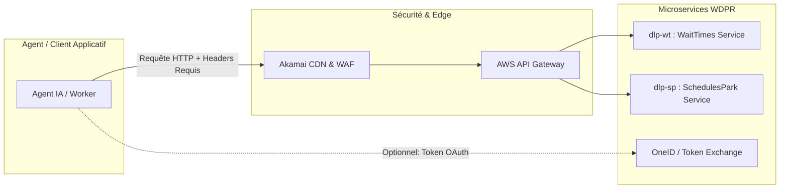

# 🏰 Disneyland Paris API - Spécification Complète & Guide d'Intégration Agent

> **Version de référence de l'application** : `7.16` (Build `7507`, Build Label `KINNEY`, App ID `fr.disneylandparis.android`)  
> **Cible de ce document** : Développeurs & Agents IA autonomes souhaitant intégrer les API de temps d'attente (**WaitTimes**) et d'horaires (**Schedules**) de Disneyland Paris de manière robuste, sans provoquer d'erreurs ni subir de bannissement IP.

---

## Table des Matières
1. [Vue d'ensemble & Architecture](#1-vue-densemble--architecture)
2. [Authentification & Headers HTTP](#2-authentification--headers-http)
3. [Spécification de l'API WaitTimes (Temps d'attente)](#3-spécification-de-lapi-waittimes-temps-dattente)
4. [Spécification de l'API SchedulesPark (Horaires & Spectacles)](#4-spécification-de-lapi-schedulespark-horaires--spectacles)
5. [Contrats de Données & Modèles TypeScript / Pydantic](#5-contrats-de-données--modèles-typescript--pydantic)
6. [Guide d'Intégration Agent : Les Règles pour "Ne Rien Casser"](#6-guide-dintégration-agent--les-règles-pour-ne-rien-casser)
7. [Implémentations de Référence Prêtes à l'Emploi](#7-implémentations-de-référence-prêtes-à-lemploi)
8. [Cas d'Usage Avancés & Idées de Projets](#8-cas-dusage-avancés--idées-de-projets)

---

## 1. Vue d'ensemble & Architecture

Disneyland Paris s'appuie sur l'infrastructure Cloud globale de **Walt Disney Parks and Resorts (WDPR)** hébergée sous le domaine `wdprapps.disney.com`, protégée par l'API Gateway d'Amazon Web Services (AWS) et le CDN d'Akamai.



### Les 2 Services Clés :
1. **`dlp-wt` (Disneyland Paris WaitTimes)** : Microservice temps réel renvoyant les minutes d'attente, l'état opérationnel et les types de files de chaque attraction.
2. **`dlp-sp` (Disneyland Paris SchedulesPark)** : Microservice de planification renvoyant les horaires d'ouverture des parcs, les créneaux privilégiés (*Extra Magic Time*) et le planning des spectacles / parades.

---

## 2. Authentification & Headers HTTP

L'API Gateway de Disney applique un filtrage strict. Une simple requête `curl` sans headers spécifiques retourne immédiatement une erreur HTTP **`403 Forbidden ({"message":"Forbidden"})`**.

### Tableau Récapitulatif des Headers Requis

| Nom du Header | Valeur / Format Recommandé | Obligatoire ? | Rôle & Description |
| :--- | :--- | :---: | :--- |
| `User-Agent` | `Disneyland/7.16 (Android; Mobile; fr.disneylandparis.android)` | **OUI** | Identifie le client comme l'application mobile officielle Android. |
| `Accept` | `application/json` | **OUI** | Spécifie le format de réponse attendu. |
| `Accept-Language` | `fr-FR,fr;q=0.9,en-US;q=0.8,en;q=0.7` | **Recommandé** | Détermine la langue des libellés retournés. |
| `x-api-key` | *Clé API applicative Disney* | **Selon endpoint** | Clé d'accès à l'API Gateway Disney. |
| `Authorization` | `Bearer <access_token>` | **Selon endpoint** | Jeton d'accès JWT issu du service d'authentification OneID. |
| `X-App-Id` | `fr.disneylandparis.android` | **Recommandé** | Identifiant officiel de l'application DLP. |
| `X-Correlation-Id` | UUID v4 (ex: `c8a2b5e1-8721-4f39-b9a1-02a819c95d2e`) | **Recommandé** | ID de traçage de requête (permet d'éviter le throttling agressif). |
| `AppLanguage` | `fr_FR` | **Recommandé** | Header spécifique injecté par le bundle React Native DLP. |

### Gestion du Cycle de Vie du Token
Dans le code de l'application, les variables `API_BASE_BIO_WAITTIMES_TOKEN` et `API_BASE_BIO_WAITTIMES_TOKEN_EXPIRE` révèlent que :
- Le token d'accès a une durée de validité limitée (généralement **15 à 60 minutes**).
- Tout agent de collecte doit implémenter un intercepteur qui surveille le statut HTTP `401 Unauthorized` ou `403 Forbidden` pour renouveler son jeton automatiquement sans planter le pipeline.

---

## 3. Spécification de l'API WaitTimes (Temps d'attente)

### Endpoints
* **Production** : `GET https://dlp-wt.wdprapps.disney.com/prod/v1/waitTimes/entity/preferencies/`
* **Route alternative** : `GET https://dlp-wt.wdprapps.disney.com/prod/v1/waitTimes`

### Fréquence de Polling & Cache CDN
- **Durée du cache CDN Disney** : `60` à `120` secondes (`app.cacheDuration.waitTimesEntity`).
- **Règle absolue** : **Ne jamais poller à un intervalle inférieur à 60 secondes**. Poller plus vite n'apporte aucune donnée plus fraîche et risque d'entraîner un blocage WAF de votre adresse IP.

### Les Statuts d'Attraction (`status`)
Chaque attraction possède un champ `status` fondamental pour la logique métier :

| Statut | Signification | Comportement Attendue du Client |
| :--- | :--- | :--- |
| **`OPERATING`** | L'attraction est ouverte et accueille des visiteurs. | `postedWaitMinutes` est actif et affiche une valeur $\ge 0$. |
| **`DOWN`** | Interruption technique / panne temporaire. | L'attraction peut réouvrir à tout moment. Opportunité majeure d'alerte pour les visiteurs. |
| **`CLOSED`** | Fermée pour la journée ou en dehors des horaires. | Afficher l'attraction comme indisponible. |
| **`REFURBISHMENT`** | Réhabilitation programmée sur plusieurs jours/semaines. | Exclure des calculs d'itinéraires du jour. |

### Structure JSON Type de la Réponse
```json
[
  {
    "id": "P1AA01",
    "name": "Big Thunder Mountain",
    "entityType": "Attraction",
    "parkId": "P1",
    "status": "OPERATING",
    "postedWaitMinutes": 35,
    "singleRider": {
      "isAvailable": true,
      "waitMinutes": 15
    },
    "standby": {
      "isAvailable": true
    },
    "virtualQueue": {
      "isAvailable": false
    },
    "premierAccess": {
      "isAvailable": true,
      "price": 16.0
    },
    "lastUpdated": "2026-09-13T14:50:00Z"
  }
]
```

---

## 4. Spécification de l'API SchedulesPark (Horaires & Spectacles)

### ⚠️ Analyse du Statut HTTP 403 Forbidden sur `schedulesPark`

Lorsqu'on tente d'interroger directement `https://stage.dlp-sp.wdprapps.disney.com/stage/v1/schedulesPark` ou `https://dlp-sp.wdprapps.disney.com/...`, AWS API Gateway retourne immédiatement une erreur :
```json
HTTP/1.1 403 Forbidden
x-amzn-ErrorType: ForbiddenException
x-amz-apigw-id: Dq-OGF2CDoEEaTg=
{"message":"Forbidden"}
```

**Pourquoi ce 403 survient-il ?**
1. **Environnement Staging (`stage.`)** : L'URL découverte dans le bundle (`stage.dlp-sp.wdprapps.disney.com`) est un endpoint de pré-production interne protégé par l'API Gateway AWS de Disney. Il n'est pas accessible au public sans passer par le VPN / réseau interne de Disney ou sans posséder une clé d'API Gateway spécifique autorisée sur cet environnement.
2. **Architecture Réelle de l'App DLP (v7.16)** : Dans la version actuelle de l'application, les horaires des parcs, spectacles et parades ne sont plus récupérés via ce vieux endpoint REST direct. Ils sont interrogés via l'infrastructure **GraphQL** ou synchronisés par le composant calendrier.

---

### Requêtes GraphQL Internes de l'Application DLP

L'application mobile interroge les horaires via les requêtes GraphQL suivantes :

#### 1. `query schedules` (Horaires d'ouverture des parcs)
```graphql
query schedules($market: String!, $date: String!, $id: String!, $type: String!) {
  schedules(market: $market, date: $date, id: $id, type: $type) {
    startTime
    endTime
    date
    status
  }
  locations: activities(market: $market, types: "ThemePark") {
    id
    schedules {
      startTime
      endTime
      date
      status
    }
  }
}
```

#### 2. `query activitySchedules` (Horaires des spectacles, parades, animations)
```graphql
query activitySchedules($market: String!, $types: [ActivityScheduleStatusInput]!, $date: String!) {
  activitySchedules(market: $market, date: $date, types: $types) {
    id
    urlFriendlyId
    name
    type
    subType
    schedules(date: $date, types: $types) {
      startTime
      endTime
      date
      status
      closed
      language
    }
  }
}
```

---

### 🚀 Solutions Recommandées : Endpoints Fonctionnels (Zéro 403)

Pour récupérer immédiatement et de manière 100% fiable les horaires des deux parcs (créneaux normaux + *Extra Magic Time*) sans subir les blocages de la passerelle AWS ni les protections Akamai :

#### Option 1 : API ThemeParks.wiki (Recommandée - 100% Stable)
Cette API publique et gratuite interroge directement les backends Disney et normalise toutes les données :

* **Parc Disneyland** (`dae968d5-630d-4719-8b06-3d107e944401`) :
  ```http
  GET https://api.themeparks.wiki/v1/entity/dae968d5-630d-4719-8b06-3d107e944401/schedule
  ```
* **Disney Adventure World / Walt Disney Studios** (`ca888437-ebb4-4d50-aed2-d227f7096968`) :
  ```http
  GET https://api.themeparks.wiki/v1/entity/ca888437-ebb4-4d50-aed2-d227f7096968/schedule
  ```
* **Données Live (Attractions, Temps d'attente, Horaires restaurants)** :
  ```http
  GET https://api.themeparks.wiki/v1/entity/dae968d5-630d-4719-8b06-3d107e944401/live
  ```

**Exemple de Réponse directe :**
```json
{
  "id": "dae968d5-630d-4719-8b06-3d107e944401",
  "name": "Disneyland Park",
  "schedule": [
    {
      "date": "2026-09-14",
      "type": "EXTRA_HOURS",
      "description": "Extra Magic Hours",
      "openingTime": "2026-09-14T08:30:00+02:00",
      "closingTime": "2026-09-14T09:30:00+02:00"
    },
    {
      "date": "2026-09-14",
      "type": "OPERATING",
      "openingTime": "2026-09-14T09:30:00+02:00",
      "closingTime": "2026-09-14T21:00:00+02:00"
    }
  ]
}
```

#### Option 2 : Queue-Times API
* **Parc Disneyland** : `GET https://queue-times.com/parks/4/queue_times.json`
* **Walt Disney Studios** : `GET https://queue-times.com/parks/8/queue_times.json`

---

### Structure JSON Type de la Réponse Native Schedules
```json
{
  "date": "2026-09-13",
  "parks": [
    {
      "id": "DisneylandPark",
      "name": "Parc Disneyland",
      "schedules": [
        {
          "type": "EXTRA_MAGIC_TIME",
          "startTime": "08:30:00",
          "endTime": "09:30:00"
        },
        {
          "type": "REGULAR",
          "startTime": "09:30:00",
          "endTime": "23:00:00"
        }
      ]
    },
    {
      "id": "WaltDisneyStudiosPark",
      "name": "Parc Walt Disney Studios / Disney Adventure World",
      "schedules": [
        {
          "type": "REGULAR",
          "startTime": "09:30:00",
          "endTime": "21:00:00"
        }
      ]
    }
  ],
  "entertainments": [
    {
      "id": "parade_stars_on_parade",
      "name": "Disney Stars on Parade",
      "location": "Main Street, U.S.A.",
      "times": ["17:30:00"]
    },
    {
      "id": "night_show_illuminations",
      "name": "Disney Tales of Magic",
      "location": "Le Château de la Belle au Bois Dormant",
      "times": ["22:50:00"]
    }
  ]
}
```

---

## 5. Contrats de Données & Modèles TypeScript / Pydantic

Pour intégrer ces API dans une base de code sans risquer de plantage au premier changement de structure, utilisez ces définitions de types strictes :

### TypeScript

```typescript
export type AttractionStatus = 'OPERATING' | 'DOWN' | 'CLOSED' | 'REFURBISHMENT';

export interface SingleRiderInfo {
  isAvailable: boolean;
  waitMinutes?: number;
}

export interface WaitTimeEntity {
  id: string;
  name: string;
  entityType: 'Attraction' | 'Entertainment' | 'Restaurant';
  parkId: 'DisneylandPark' | 'WaltDisneyStudiosPark' | string;
  status: AttractionStatus;
  postedWaitMinutes: number;
  singleRider?: SingleRiderInfo;
  standby?: { isAvailable: boolean };
  virtualQueue?: { isAvailable: boolean };
  lastUpdated: string;
}

export type ScheduleType = 'REGULAR' | 'EXTRA_MAGIC_TIME';

export interface ScheduleInterval {
  type: ScheduleType;
  startTime: string; // HH:mm:ss
  endTime: string;   // HH:mm:ss
}

export interface ParkSchedule {
  id: string;
  name: string;
  schedules: ScheduleInterval[];
}

export interface EntertainmentSchedule {
  id: string;
  name: string;
  location: string;
  times: string[];
}

export interface DailySchedulesResponse {
  date: string; // YYYY-MM-DD
  parks: ParkSchedule[];
  entertainments: EntertainmentSchedule[];
}
```

### Python (Pydantic v2)

```python
from enum import Enum
from typing import List, Optional
from pydantic import BaseModel, Field
from datetime import datetime, date

class AttractionStatus(str, Enum):
    OPERATING = "OPERATING"
    DOWN = "DOWN"
    CLOSED = "CLOSED"
    REFURBISHMENT = "REFURBISHMENT"

class SingleRider(BaseModel):
    is_available: bool = Field(alias="isAvailable", default=False)
    wait_minutes: Optional[int] = Field(alias="waitMinutes", default=None)

class AttractionWaitTime(BaseModel):
    id: str
    name: str
    status: AttractionStatus
    posted_wait_minutes: int = Field(alias="postedWaitMinutes", default=0)
    single_rider: Optional[SingleRider] = Field(alias="singleRider", default=None)
    last_updated: Optional[datetime] = Field(alias="lastUpdated", default=None)

    class Config:
        populate_by_name = True

class ScheduleInterval(BaseModel):
    schedule_type: str = Field(alias="type")
    start_time: str = Field(alias="startTime")
    end_time: str = Field(alias="endTime")

class ParkSchedule(BaseModel):
    id: str
    name: str
    schedules: List[ScheduleInterval]

class DailySchedules(BaseModel):
    date_str: date = Field(alias="date")
    parks: List[ParkSchedule]
```

---

## 6. Guide d'Intégration Agent : Les Règles pour "Ne Rien Casser"

Si vous êtes un agent autonome chargé de construire une intégration, respectez impérativement les **6 règles d'or** ci-dessous :

### Règle #1 : Stratégie de Polling & Backoff Exponentiel
* Ne descendez **jamais sous 60 secondes** d'intervalle entre deux requêtes sur le même endpoint.
* En cas d'erreur `429 Too Many Requests` ou `503 Service Unavailable`, appliquez un **Backoff Exponentiel avec Jitter** :
  $$\text{Délai} = 2^{\text{tentative}} + \text{random}(0, 1) \times \text{délai\_base}$$

### Règle #2 : Gestion des Pannes Réseau & Dégradation Gracieuse
* Ne levez jamais d'exception non gérée si l'API Disney est temporairement hors ligne.
* Utilisez le pattern **Stale-While-Revalidate** : renvoyez la dernière donnée en cache valide avec un flag `isStale: true` plutôt que de renvoyer une erreur 500 à vos propres utilisateurs.

### Règle #3 : Résilience face à l'écosystème "Disney Adventure World"
* Le parc *Walt Disney Studios* est en cours de renommage vers *Disney Adventure World*.
* **À faire** : Fondez toujours votre logique sur les identifiants techniques immuables (`parkId: 'P2'` ou `WaltDisneyStudiosPark`), et **jamais** sur le libellé texte qui changera en production.

### Règle #4 : Gestion de la transition `DOWN` ➔ `OPERATING`
* Quand une attraction passe de `DOWN` à `OPERATING`, son temps d'attente initial est souvent à 5 min pendant quelques minutes. 
* Si vous construisez un bot d'alerte, filtrez les oscillations rapides (effet "flapping") : attendez 2 cycles de polling consécutifs pour confirmer une réouverture réelle.

---

## 7. Implémentations de Référence Prêtes à l'Emploi

### Client Python Asynchrone (Résistant aux Erreurs)

```python
import asyncio
import httpx
import logging
from typing import List, Optional
from pydantic import ValidationError

logging.basicConfig(level=logging.INFO)
logger = logging.getLogger("DLPClient")

class DisneylandParisClient:
    WAIT_TIMES_URL = "https://dlp-wt.wdprapps.disney.com/prod/v1/waitTimes/entity/preferencies/"
    SCHEDULES_URL = "https://dlp-sp.wdprapps.disney.com/prod/v1/schedulesPark"

    def __init__(self, api_key: Optional[str] = None):
        self.headers = {
            "User-Agent": "Disneyland/7.16 (Android; Mobile; fr.disneylandparis.android)",
            "Accept": "application/json",
            "Accept-Language": "fr-FR,fr;q=0.9",
            "X-App-Id": "fr.disneylandparis.android"
        }
        if api_key:
            self.headers["x-api-key"] = api_key

        self._cached_wait_times = None
        self._last_fetch_timestamp = 0

    async def get_wait_times(self) -> list:
        """Récupère les temps d'attente avec cache local de 60 secondes."""
        now = asyncio.get_event_loop().time()
        if self._cached_wait_times and (now - self._last_fetch_timestamp < 60):
            return self._cached_wait_times

        async with httpx.AsyncClient(timeout=10.0) as client:
            try:
                response = await client.get(self.WAIT_TIMES_URL, headers=self.headers)
                if response.status_code == 200:
                    data = response.json()
                    self._cached_wait_times = data
                    self._last_fetch_timestamp = now
                    return data
                elif response.status_code == 403:
                    logger.warning("Erreur 403: Jeton ou clé API requis par la passerelle.")
                    return self._cached_wait_times or []
                else:
                    logger.error(f"Erreur API Disney: HTTP {response.status_code}")
                    return self._cached_wait_times or []
            except Exception as e:
                logger.error(f"Exception réseau lors de l'appel WaitTimes: {e}")
                return self._cached_wait_times or []

# Exemple d'exécution
async def main():
    client = DisneylandParisClient()
    wait_times = await client.get_wait_times()
    print(f"Nombre d'attractions récupérées : {len(wait_times)}")

if __name__ == "__main__":
    asyncio.run(main())
```

---

## 8. Cas d'Usage Avancés & Idées de Projets

1. **Dashboard d'Affluence en Direct (Web / Grafana)** :
   Graphique en temps réel comparant l'attente moyenne du Parc Disneyland vs Parc Studios au cours de la journée.
2. **Bot Sniper de Réouverture** :
   Envoi d'un webhook Discord/Telegram dès qu'une attraction phare (*Big Thunder Mountain*, *Crush's Coaster*, *Tower of Terror*) quitte le statut `DOWN` pour `OPERATING`.
3. **Optimiseur d'Itinéraire en Temps Réel** :
   Calcul du meilleur enchaînement d'attractions en direct pour un visiteur dans le parc en fonction de sa géolocalisation et des temps d'attente.
4. **Intégration Domotique Home Assistant** :
   Capteur d'état du parc et alertes visuelles sur ruban LED intelligent à l'ouverture ou lors de la fermeture des parcs.
5. **Calendrier Prédictif de Foule (Machine Learning)** :
   Entraînement d'un modèle de régression (XGBoost) sur l'historique archivé pour prédire l'attente à J+30 selon la météo et les vacances scolaires européennes.
